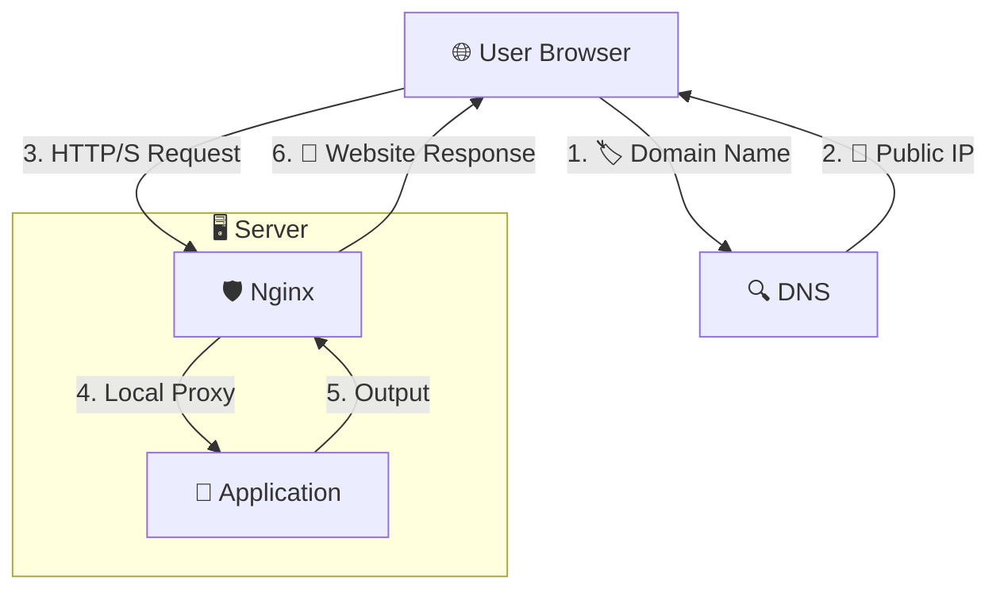

# Web Request Lifecycle

```mermaid
graph TD
    Browser["🌐 User Browser"] -->|1. 🏷️ Domain Name| DNS["🔍 DNS"]
    DNS -->|2. 📍 Public IP| Browser
    Browser -->|3. HTTP/S Request| Nginx["🛡️ Nginx"]
    
    subgraph Server ["🖥️ Server"]
        Nginx -->|4. Local Proxy| App["🚀 Application"]
        App -->|5. Output| Nginx
    end
    
    Nginx -->|6. 📄 Website Response| Browser
```